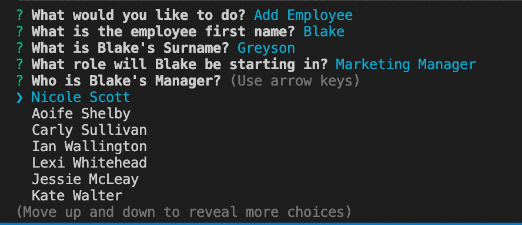

# employee-management-system
A command line application to manage a company's employees using node, inquirer, and MySQL

## Description & FULL Demo
---
This command line application helps a user to keep track of the employees in their company including, departments, roles, salarys, managers and having the ability to add and remove the aforementioned as necessary.  The demo video [here](https://drive.google.com/file/d/1MnPQ1ORe8ZgUrnhI4kmT3VfOO9Z-eI48/view?usp=sharing) will show the full capabilities of the application.  For more information see below.  

## Screenshots
---
The following images show the web application's appearance and functionality: 

## Tools & Technologies
---
    * I used a queryHandler function to minimise the repetition in the code.  This then needed to be promisified in order to ensure that the table was rendered before the confirmPrompt function was called.  I tried both Callback and new Promise and felt that newPromise added readablity in the index file so went with that method.  
    * I needed to use a callback function to bring in the array data before then using that data in the choices of my prompts
    * I had an issue with promptHandler being a circular reference initially so I created confirmPrompt to handle the return or exit, but then once i moved all my functions and the prompptHandler into one file this mitigated the need for the confirmPrompt.   
    * I used dotenv to hide my personal login details, but added a EXAMPLE file so that anyone coming in to use my application would know what data to enter.  
    * npm packages: 
      - ASCII Logo to create the fancy logo on start
      - mysql
      - dotenv
      - console.table to render the output data from the database.  (I didn't like that it rendered an index line in the table, but haven't been able to hide it - read on stack overflow that its a part of console table and can't be changed)
      - inquirer for the questions

## Installation
---
You can view the project on my github repo (link below).  
To do this you will need to clone repository, open the server.js file in integrated terminal and enter 'npm i' to install dependancies.  Use the sql, and seeds files in db folder to create the database.  From there you can run 'npm start' in terminal and the command line prompts will begin in terminal.  

## Questions?
---
  If you have any questions about this project, please contact me directly on [email](mailto:catormerod@gmail.com). You can view more of my projects at [Github](https://github.com/catormerod) or this specific project at [Employee Tracker](https://github.com/CatOrmerod/employee-management-system). 

  The demo video can be viewed at the following link: [Demo Video](https://drive.google.com/file/d/1MnPQ1ORe8ZgUrnhI4kmT3VfOO9Z-eI48/view?usp=sharing)
